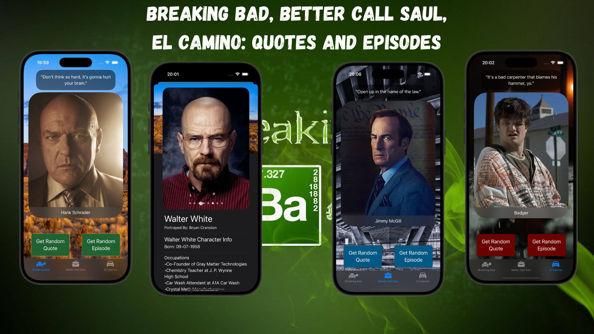

# BBQuotes



## Description  

**BBQuotes** is a SwiftUI application that fetches and displays random quotes from the legendary TV series **Breaking Bad**, **Better Call Saul**, and the movie **El Camino**. Immerse yourself in the iconic dialogue and explore the characters behind these unforgettable lines.  

## Features  

- **Random Quote Display:** Fetch and display a random quote from the selected show.  
- **Character Information:** View the character name and an image associated with each quote.  
- **Random Episode Fetching:** Get a random episode from the selected show for a deeper dive into the story. *(New in v2.0!)*  
- **Error Handling:** Gracefully handles potential errors like bad network requests or invalid responses.  

## Technologies Used  

- **SwiftUI:** A modern declarative UI framework for iOS.  
- **Async/Await & URLSession:** Efficient asynchronous network requests.  
- **MVVM Architecture:** Clean separation between data, logic, and UI.  
- **JSON Decoding:** Fetching and parsing structured data seamlessly.  

## Implementation Details  

The app follows a **clean architecture** with:  

- Structured **data models** for quotes, characters, and episodes.  
- An **observable ViewModel** to manage API requests and state changes.  
- **FetchService** for handling API interactions efficiently.  

## Fetching a Random Quote  

The app fetches quotes from the **Breaking Bad API** using a clean, reusable method inside `FetchService`.  

```swift
struct FetchService {
    enum FetchError: Error {
        case badResponse
    }
    
    let baseURL = URL(string: "https://breaking-bad-api-six.vercel.app/api")!
    
    func fetchQuote(from show: String) async throws -> Quote {
        let quoteURL = baseURL.appending(path: "quotes/random")
        let fetchURL = quoteURL.appending(queryItems: [URLQueryItem(name: "production", value: show)])

        let (data, response) = try await URLSession.shared.data(from: fetchURL)

        guard let response = response as? HTTPURLResponse, response.statusCode == 200 else {
            throw FetchError.badResponse
        }

        return try JSONDecoder().decode(Quote.self, from: data)
    }
}
```

## ViewModel Integration  

The ViewModel coordinates fetching quotes, character info, and episodes while managing the app's state.  

```swift
@Observable
@MainActor
class ViewModel {
    enum FetchStatus {
        case notStarted
        case fetching
        case successQuote
        case successEpisode
        case failed(error: Error)
    }

    private(set) var status: FetchStatus = .notStarted
    private let fetcher = FetchService()

    var quote: Quote
    var character: Char
    var episode: Episode

    func getQuoteData(for show: String) async {
        status = .fetching
        do {
            quote = try await fetcher.fetchQuote(from: show)
            character = try await fetcher.fetchCharacter(quote.character)
            status = .successQuote
        } catch {
            status = .failed(error: error)
        }
    }

    func getEpisode(for show: String) async {
        status = .fetching
        do {
            if let unwrappedEpisode = try await fetcher.fetchEpisode(from: show) {
                episode = unwrappedEpisode
            }
            status = .successEpisode
        } catch {
            status = .failed(error: error)
        }
    }
}
```

## Dynamic UI with SwiftUI

The app presents fetched data dynamically with SwiftUI components. It supports smooth transitions between quotes and episodes while ensuring a clean user experience.

```swift
import SwiftUI

struct FetchView: View {
    let vm = ViewModel()
    let show: String
    
    @State private var isShowingCharacterInfo = false
    
    var body: some View {
        GeometryReader { geo in
            ZStack {
                Image(show.removeCaseAndSpace())
                    .resizable()
                    .frame(width: geo.size.width * 2.7, height: geo.size.height * 1.2)
                
                VStack {
                    VStack {
                    Spacer(minLength: 60)
                    
                    switch vm.status {
                    case .notStarted:
                        EmptyView()
                        
                    case .fetching:
                        ProgressView()
                        
                    case .successQuote:
                        Text("\"\(vm.quote.quote)\"")
                            .minimumScaleFactor(0.5)
                            .multilineTextAlignment(.center)
                            .foregroundStyle(.white)
                            .padding()
                            .background(.black.opacity(0.5))
                            .clipShape(.rect(cornerRadius: 25))
                            .padding(.horizontal)
                        
                        ZStack(alignment: .bottom) {
                            AsyncImage(url: vm.character.images.randomElement()) { image in
                                image
                                    .resizable()
                                    .scaledToFill()
                            } placeholder: {
                                ProgressView()
                            }
                            .frame(width: geo.size.width/1.1, height: geo.size.height/1.8)
                            
                            Text(vm.quote.character)
                                .foregroundStyle(.white)
                                .padding(10)
                                .frame(maxWidth: .infinity)
                                .background(.ultraThinMaterial)
                        }
                        .frame(width: geo.size.width/1.1, height: geo.size.height/1.8)
                        .clipShape(.rect(cornerRadius: 50))
                        .onTapGesture {
                            isShowingCharacterInfo.toggle()
                        }
                        
                    case .successEpisode:
                        EpisodeView(episode: vm.episode)
                        
                    case .failed(let error):
                        Text(error.localizedDescription)
                    }
                    
                        Spacer(minLength: 20)

```
## Credits

- This project is a tutorial from Kenneth Jones' [UDEMY Course](https://www.udemy.com/course/ios-15-app-development-with-swiftui-3-and-swift-5/?couponCode=KEEPLEARNING): "iOS 18, SwiftUI 6, & Swift 6: Build iOS Apps From Scratch".
- This project is inspired by the popular TV shows "Breaking Bad" and "Better Call Saul" and the movie "El Camino.
- The Breaking Bad API used in this project is provided by [BREAKING BAD API](https://breaking-bad-api-six.vercel.app/).

## Author

- [alcode111](https://github.com/alcode111)

